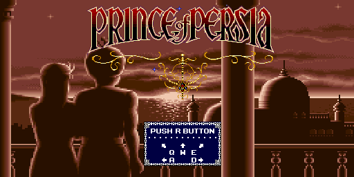

# Prince of Persia — MIPS Assembly



Implementação do clássico **Prince of Persia** em linguagem Assembly MIPS, desenvolvida para o simulador **MARS** (MIPS Assembler and Runtime Simulator). O projeto recria a essência do jogo original com sprites pixel-art, sistema de física, combate, inimigos autônomos e efeitos sonoros.

---

## Sumário

- [Pré-requisitos](#-pré-requisitos)
- [Como executar](#-como-executar)
- [Controles](#-controles)
- [Gameplay](#-gameplay)
- [Arquitetura do projeto](#-arquitetura-do-projeto)
- [Sistema de colisão por tiles](#-sistema-de-colisão-por-tiles)
- [Sistema de sprites](#-sistema-de-sprites)
- [Sistema de som](#-sistema-de-som)
- [Documentação das funções](#-documentação-das-funções)
  - [main.asm](#mainasm)
  - [controlarCenarios.asm](#controlarcenariosasm)
  - [colisoes.asm](#colisoesasm)
  - [renderizarCenario.asm](#renderizarcenarioasm)
  - [renderizarPersonagem.asm](#renderizarpersonagemasm)
  - [atualizarInimigo.asm](#atualizarinimigoasm)
  - [sons.asm](#sonsasm)
- [Ferramentas de conversão](#-ferramentas-de-conversão)
- [Créditos](#-créditos)

---

## Pré-requisitos

- **[MARS MIPS Simulator](https://courses.missouristate.edu/KenVollmar/MARS/)** (versão 4.5 ou superior)
- Java Runtime Environment (JRE) para executar o MARS
- Sistema operacional: Windows, Linux ou macOS

---

## Como executar

1. **Abra o MARS Simulator**
   ```bash
   java -jar mars.jar
   ```

2. **Carregue o arquivo principal**
   - Vá em **File → Open** ou clique no ícone da pasta
   - Selecione `main.asm`

3. **Configure a memória de vídeo (Bitmap Display)**
   - Vá em **Tools → Bitmap Display**
   - Configure:
     - **Base address for display:** `0x10010000` (padrão)
     - **Display Width:** `512`
     - **Display Height:** `256`
     - **Display Unit Width in Pixels:** `1`
     - **Display Unit Height in Pixels:** `1`
   - Clique em **Connect to MIPS**

4. **Configure o teclado (Keyboard and Display MMIO Simulator)**
   - Vá em **Tools → Keyboard and Display MMIO Simulator**
   - Clique em **Connect to MIPS**

5. **Execute o jogo**
   - Pressione **F5** (Assemble and Run) ou vá em **Run → Assemble**
   - Após a montagem, clique em **Run** (botão de play) ou pressione **F5** novamente
   - **Importante:** coloque a velocidade de execução em **Run speed at maximum** (no menu Run → Set Speed) para melhor desempenho

6. **Interaja com o jogo**
   - Clique na janela **Keyboard and Display MMIO Simulator** para capturar o teclado
   - Pressione as teclas de controle (veja abaixo)

---

##  Controles

| Tecla | Ação |
|-------|------|
| `A` | Mover para esquerda |
| `D` | Mover para direita |
| `W` | Pular verticalmente |
| `Q` | Pular diagonal (esquerda+cima) |
| `E` | Pular diagonal (direita+cima) |
| `S` | Atacar com espada |
| `R` | Resetar jogo (voltar ao início) |
| `X` | Sair do jogo |

### Dicas de jogabilidade
- O príncipe pode andar sobre plataformas e pular entre elas
- Pressione `S` para atacar quando estiver próximo ao inimigo
- O inimigo precisa de **3 golpes** para ser derrotado
- Encostar no inimigo causa morte instantânea
- Chegue ao final da fase 2 para completar o jogo (lado direito da tela)

---

## Gameplay

| Tela | Descrição |
|------|-----------|
| **Menu Principal** (Cenário 0) | Tela inicial do jogo. Pressione `R` para iniciar. |
| **Fase 1** (Cenário 1) | Primeira fase com plataformas e obstáculos. Chegue ao lado direito para avançar. |
| **Fase 2** (Cenário 2) | Fase final com inimigo autônomo. Derrote-o e chegue ao lado direito para vencer. |

Após completar a fase 2, uma fanfarra de vitória é reproduzida e o jogo retorna ao menu principal.

---

## Estatísticas do projeto

### Visão geral

| Métrica | Valor |
|---------|-------|
| Arquivos `.asm` | 33 |
| Total de linhas Assembly | **2.919** |
| Imagens originais (PNG) | 21 |
| Scripts Python | 2 |
| Cenários/fases | 3 (menu, fase 1, fase 2) |
| Mapas de colisão | 2 (32×16 tiles cada) |
| Sprites do personagem | 8 |  
| Sprites do inimigo | 4 frames |
| Efeitos sonoros | 9 |

### Linhas de código por categoria

| Categoria | Arquivos | Linhas | % do total |
|-----------|----------|--------|------------|
| **Cenários** (imagens do framebuffer) | `cenarios/*.asm` | 1.094 | 37,5% |
| **Lógica do jogo** | `util/*.asm`, `main.asm`, `personagem/*.asm`, `inimigo/*.asm` | **1.163** | 39,8% |
| **Sprites** (personagens) | `sprites/*.asm` | 610 | 20,9% |
| **Mapas de tile** (colisão) | `tiles/*.asm` | 34 | 1,1% |

### Detalhamento dos módulos de lógica

| Módulo | Arquivo | Linhas | Responsabilidade |
|--------|---------|--------|------------------|
| Controles | `controlarCenarios.asm` | 420 | Input, física, colisão, combate, transições |
| Renderização de cenários | `renderizarCenario.asm` | 230 | Desenho de fundo, dirty rects, delay |
| Som | `sons.asm` | 128 | 9 efeitos sonoros MIDI |
| Sprites | `renderizarPersonagem.asm` | 92 | Desenho/restauração de sprites |
| Colisão | `colisoes.asm` | 79 | Sistema de tiles 16×16 |
| Renderização espelhada | `renderizarCenarioEspelhado.asm` | 60 | Debug (visualização espelhada) |
| Main | `main.asm` | 48 | Entry point, variáveis globais |
| Primitivas gráficas | `linhasRetangulos.asm` | 44 | Pixel, linha, retângulo |
| IA do inimigo | `atualizarInimigo.asm` | 33 | Movimento autônomo vertical |
| Controles espelhados | `controlarCenariosEspelhado.asm` | 29 | Navegação de debug |
| Testes | `testes.asm` | 18 | Bootstrap de testes |

> **Arquitetura modular:** cada sistema do jogo (controles, colisão, renderização, sprites, IA do inimigo, som) está isolado em seu próprio arquivo `.asm` dentro de uma hierarquia de diretórios (`util/`, `personagem/`, `inimigo/`). Isso permite modificar ou substituir qualquer módulo sem afetar os demais, facilitando manutenção e reaproveitamento.

---

## Arquitetura do projeto

```
Prince-of-Persia---Assembly-MIPS/
├── main.asm                          # Arquivo principal (entry point)
├── README.md                         # Documentação
│
├── cenarios/                         # Imagens dos cenários (framebuffer)
│   ├── stage0.asm                    # Menu principal (512×256)
│   ├── stage1.asm                    # Fase 1 (512×256)
│   ├── stage2.asm                    # Fase 2 (512×256)
│   ├── dummy.asm                     # Buffer vazio (512×256)
│   ├── alunos_transparente.asm       # Teste de transparência
│   └── pikachu.asm                   # Sprite de teste
│
├── tiles/                            # Mapas de colisão (matriz 32×16)
│   ├── stage1.asm                    # Mapa de tiles da fase 1
│   └── stage2.asm                    # Mapa de tiles da fase 2
│
├── sprites/                          # Sprites dos personagens
│   ├── prince_idle_right.asm         # Príncipe parado → direita (9×42)
│   ├── prince_idle_left.asm          # Príncipe parado → esquerda
│   ├── prince_jump_right.asm         # Príncipe pulando → direita (50×30)
│   ├── prince_jump_left.asm          # Príncipe pulando → esquerda
│   ├── prince_attack_sword_right.asm # Príncipe atacando → direita (65×32)
│   ├── prince_attack_sword_left.asm  # Príncipe atacando → esquerda
│   ├── inimigo1-frame1.asm           # Inimigo frame 1 (39×50)
│   ├── inimigo1-frame2.asm           # Inimigo frame 2
│   ├── inimigo1-frame3.asm           # Inimigo frame 3
│   ├── inimigo1-frame4.asm           # Inimigo frame 4
│   ├── gordo-parado.asm              # Sprite de teste
│   └── gordo-defendendo.asm          # Sprite de teste
│
├── personagem/
│   └── renderizarPersonagem.asm      # Renderização e restauração de sprites
│
├── inimigo/
│   └── atualizarInimigo.asm          # IA e física do inimigo
│
├── util/
│   ├── controle/
│   │   ├── controlarCenarios.asm     # Lógica principal do jogo
│   │   ├── controlarCenariosEspelhado.asm # Seletor de cenários (debug)
│   │   └── colisoes.asm              # Sistema de colisão por tiles
│   ├── renders/
│   │   ├── renderizarCenario.asm     # Renderização de cenários + delay
│   │   └── renderizarCenarioEspelhado.asm # Renderização espelhada (debug)
│   ├── formas/
│   │   └── linhasRetangulos.asm      # Primitivas gráficas (pixel, linha, retângulo)
│   └── som/
│       └── sons.asm                  # Efeitos sonoros MIDI
│
├── scripts/                          # Ferramentas Python
│   ├── conversor_sprites.py          # PNG → .asm (sprites)
│   └── conversor_cenarios.py         # PNG → .asm (cenários)
│
└── images/                           # Imagens originais (PNG)
    ├── menuprincipal.png
    ├── cenario1.png
    ├── cenario2.png
    ├── cenario1_tiles.png
    ├── cenario2_tiles.png
    ├── prince_idle_right.png
    ├── prince_jump_right.png
    ├── prince_attack_sword_right.png
    └── ... (demais sprites)
```

### Fluxo de execução

O jogo segue um loop infinito com a seguinte estrutura:

```
main → game_loop → controlesCenario:
                     ├── acionarCaracter (polling do teclado)
                     ├── interpretação da tecla:
                     │   ├── W/Q/E → pulo (com som)
                     │   ├── S → ataque (com som, verifica hitbox)
                     │   ├── A/D → movimento (com colisão)
                     │   └── R/X → reset/sair
                     ├── aplicar_fisica:
                     │   ├── gravidade (velocidade_y += 1)
                     │   ├── colisão vertical
                     │   ├── pouso no chão (com som)
                     │   └── drift horizontal
                     ├── verificar cooldown do ataque
                     ├── verificar contato com inimigo
                     ├── verificar limites da tela
                     ├── transição de cenários
                     └── redirecionar_cenario:
                         ├── renderizarCenarioZero  (menu)
                         ├── renderizarCenarioUm    (fase 1)
                         └── renderizarCenarioDois  (fase 2 + inimigo)
```

---

##  Sistema de colisão por tiles

### Conceito

O cenário é dividido em uma grade de **tiles** de **16×16 pixels**. Cada tile armazena um valor que determina seu comportamento de colisão:

| Valor | Significado | Descrição |
|-------|-------------|-----------|
| **0** |   Vazio | Ar livre, personagem pode passar |
| **1** |   Sólido | Parede, chão ou plataforma (bloqueia) |
| **2** |   Perigo | espinhos (morte instantânea) |

### Mapa de tiles na memória

O mapa de colisão é uma matriz bidimensional armazenada linearmente na memória. A fase 1 (`stage_map1`) e a fase 2 (`stage_map2`) são matrizes de **32 colunas × 16 linhas** = 512 tiles.

```
Mapa de tiles (32×16):
┌───┬───┬───┬───┬───┬───┬───┬───┬───┬───┬───┬───┬───┬───┬───┬───┬───┬───┬───┬───┬───┬───┬───┬───┬───┬───┬───┬───┬───┬───┬───┬───┐
│ 0 │ 0 │ 0 │ 0 │ 0 │ 0 │ 0 │ 0 │ 0 │ 0 │ 0 │ 0 │ 0 │ 0 │ 0 │ 0 │ 0 │ 0 │ 0 │ 0 │ 0 │ 0 │ 0 │ 0 │ 0 │ 0 │ 0 │ 0 │ 0 │ 0 │ 0 │ 0 │
├───┼───┼───┼───┼───┼───┼───┼───┼───┼───┼───┼───┼───┼───┼───┼───┼───┼───┼───┼───┼───┼───┼───┼───┼───┼───┼───┼───┼───┼───┼───┼───┤
│ 0 │ 0 │ 0 │ 0 │ 0 │ 0 │ 0 │ 0 │ 0 │ 0 │ 0 │ 0 │ 0 │ 0 │ 1 │ 1 │ 1 │ 1 │ 1 │ 1 │ 1 │ 1 │ 1 │ 1 │ 1 │ 0 │ 0 │ 0 │ 0 │ 0 │ 0 │ 0 │
├───┼───┼───┼───┼───┼───┼───┼───┼───┼───┼───┼───┼───┼───┼───┼───┼───┼───┼───┼───┼───┼───┼───┼───┼───┼───┼───┼───┼───┼───┼───┼───┤
│ 1 │ 1 │ 1 │ 1 │ 1 │ 1 │ 1 │ 1 │ 1 │ 1 │ 1 │ 0 │ 0 │ 0 │ 1 │ 1 │ 1 │ 1 │ 1 │ 1 │ 1 │ 1 │ 1 │ 1 │ 1 │ 0 │ 0 │ 0 │ 0 │ 0 │ 0 │ 0 │
├───┼───┼───┼───┼───┼───┼───┼───┼───┼───┼───┼───┼───┼───┼───┼───┼───┼───┼───┼───┼───┼───┼───┼───┼───┼───┼───┼───┼───┼───┼───┼───┤
│...│...│...│...│...│...│...│...│...│...│...│...│...│...│...│...│...│...│...│...│...│...│...│...│...│...│...│...│...│...│...│...│
├───┼───┼───┼───┼───┼───┼───┼───┼───┼───┼───┼───┼───┼───┼───┼───┼───┼───┼───┼───┼───┼───┼───┼───┼───┼───┼───┼───┼───┼───┼───┼───┤
│ 1 │ 1 │ 1 │ 1 │ 1 │ 1 │ 1 │ 1 │ 1 │ 1 │ 1 │ 1 │ 1 │ 1 │ 1 │ 1 │ 1 │ 1 │ 1 │ 1 │ 1 │ 1 │ 1 │ 1 │ 1 │ 1 │ 1 │ 1 │ 1 │ 1 │ 1 │ 1 │
└───┴───┴───┴───┴───┴───┴───┴───┴───┴───┴───┴───┴───┴───┴───┴───┴───┴───┴───┴───┴───┴───┴───┴───┴───┴───┴───┴───┴───┴───┴───┴───┘
```

### Conversão coordenada → tile

Dada uma coordenada (X, Y) em pixels, o tile correspondente é calculado por:

```
tile_X = X / 16   (divisão inteira por 16)
tile_Y = Y / 16   (divisão inteira por 16)
índice = (tile_Y * 32 + tile_X) * 4  (cada word = 4 bytes)
```

Implementação em `colisoes.asm`:
```asm
srl $t0, $a0, 4          # tile_X = X / 16
srl $t1, $a1, 4          # tile_Y = Y / 16
sll $t2, $t1, 5          # tile_Y * 32
addu $t2, $t2, $t0       # + tile_X
sll $t2, $t2, 2          # * 4 bytes (word offset)
```

### Pontos de verificação

O personagem (bounding box 9×42 pixels) é verificado em **6 pontos** no contorno da sua hitbox:

```
   (X,Y) ┌─────┐ (X+8,Y)
         │     │
 (X,Y+21)├─────┤ (X+8,Y+21)
         │     │
(X,Y+41) └─────┘ (X+8,Y+41)
```

Cada ponto é convertido em tile e o maior valor entre todos é retornado. Se qualquer ponto cair em um tile de valor 2, o personagem morre. Se cair em tile 1, o movimento é bloqueado.

### Mapas das fases

| Fase | Mapa de tiles | Arquivo |
|------|---------------|---------|
| 1 | `stage_map1` | `tiles/stage1.asm` |
| 2 | `stage_map2` | `tiles/stage2.asm` |

---

## Sistema de sprites

### Origem dos sprites

Os sprites dos cenários foram extraídos e adaptados do jogo **Prince of Persia** de **Super Nintendo** (SNES). Os sprites originais passaram por um processo de:

1. **Captura de tela** do jogo original no SNES
2. **Recorte manual** dos sprites individuais usando o software **Aseprite**
3. **Redesenho e adaptação** de alguns sprites para se adequarem ao estilo do projeto
4. **Exportação** como PNG e conversão para Assembly MIPS via script Python

### Sprites do Príncipe

| Sprite | Tamanho | Descrição |
|--------|---------|-----------|
| `prince_idle_right` / `prince_idle_left` | 9×42 | Parado, com/postura neutra |
| `prince_jump_right` / `prince_jump_left` | 50×30 | Pulo, braços abertos |
| `prince_attack_sword_right` / `prince_attack_sword_left` | 65×32 | Atacando com espada |

### Sprite do Inimigo

| Sprite | Tamanho | Descrição |
|--------|---------|-----------|
| `inimigo1-frame1` | 39×50 | Frame 1 (idle/flutuando) |
| `inimigo1-frame2` | 39×50 | Frame 2 |
| `inimigo1-frame3` | 39×50 | Frame 3 |
| `inimigo1-frame4` | 39×50 | Frame 4 |

### Transparência

Os sprites utilizam **transparência por color key**: pixels com valor `0x00000000` (preto com alpha zero) não são desenhados no framebuffer, permitindo que o fundo do cenário apareça por trás.

### Sistema de "Retângulos Sujos" (Dirty Rectangles)

Para otimizar a renderização, o jogo não redesenha o cenário completo a cada frame. Em vez disso:

1. **Primeiro frame:** desenha o cenário inteiro (`atualizar_fundo = 1`)
2. **Frames seguintes:** restaura apenas a área onde o personagem estava no frame anterior, copiando os pixels do cenário original para o framebuffer
3. **Desenha** o personagem na nova posição

Isso reduz drasticamente o número de pixels copiados por frame.

---

## Sistema de som

O sistema de som utiliza as **syscalls MIDI** do simulador MARS:

- **Syscall 31:** MIDI output não-bloqueante (retorna imediatamente)
- **Syscall 33:** MIDI output bloqueante (espera a duração do som)

### Efeitos sonoros implementados

| Evento | Função | Instrumento MIDI | Nota | Duração |
|--------|--------|-------------------|------|---------|
| Ataque | `play_som_ataque` | Orchestra Hit (119) | D5 (74) | 80ms |
| Pulo | `play_som_pulo` | Bird Tweet (123) | G4 (67) | 100ms |
| Morte | `play_som_morte` | Gunshot (127) | C2 (36) | 400ms |
| Acertar inimigo | `play_som_acerto_inimigo` | Fret Noise (122) | C4 (60) | 60ms |
| Inimigo derrotado | `play_som_inimigo_morto` | Brass (61) | E4→B4 | 120+200ms |
| Fase completa | `play_som_fase_completa` | Synth Brass (63) | C4→E4→G4→C5 | 4 notas |
| Pouso no chão | `play_som_pouso` | Melodic Tom (117) | C3 (48) | 80ms |
| Transição | `play_som_transicao` | Square Wave (80) | C5→C4 | 100+100ms |

---

## Documentação das funções

### `main.asm`

**Arquivo principal.** É o ponto de entrada do programa. Contém:

- A seção `.data` com todas as variáveis globais do jogo (posição do personagem, estado do inimigo, física, combate)
- As diretivas `.include` que importam todos os módulos do projeto
- O loop principal (`game_loop`) que chama `controlesCenario` infinitamente

**Variáveis globais:**

| Variável | Tipo | Descrição |
|----------|------|-----------|
| `prince_x`, `prince_y` | word | Posição atual do príncipe |
| `prince_old_x`, `prince_old_y` | word | Posição anterior (dirty rect) |
| `inimigo_x`, `inimigo_y` | word | Posição do inimigo |
| `inimigo_old_x`, `inimigo_old_y` | word | Posição anterior do inimigo |
| `inimigo_jump_dir` | word | Direção do pulo (1=sobe, -1=desce) |
| `inimigo_jump_count` | word | Contador de deslocamento do inimigo |
| `cenario_atual` | word | Cenário ativo (0=menu, 1=fase1, 2=fase2) |
| `atualizar_fundo` | word | Flag de redesenho completo |
| `velocidade_y` | word | Velocidade vertical do príncipe |
| `velocidade_x` | word | Velocidade horizontal (drift) |
| `no_chao` | word | Flag de contato com o chão |
| `direcao` | word | Direção do sprite (1=dir, -1=esq) |
| `inimigo_vida` | word | HP do inimigo (3 hits) |
| `inimigo_vivo` | word | Flag de vida do inimigo |
| `atacando` | word | Frames restantes de ataque |
| `ataque_cooldown` | word | Frames de cooldown do ataque |

---

### `controlarCenarios.asm`

**Núcleo do loop de jogo.** Localizado em `util/controle/controlarCenarios.asm`.

**Funções:**

#### `controlesCenario`
- Polling do teclado via MMIO (endereço `0xFFFF0000`)
- Mapeamento de teclas para ações (movimento, pulo, ataque, reset)
- Roteamento para física e renderização

#### `iniciar_pulo`, `pulo_esquerda`, `pulo_direita`
- Verifica se está no chão (`no_chao`)
- Define velocidade vertical (`velocidade_y = -16`) e horizontal (0, -5 ou +5)
- Remove flag de chão
- Reproduz som de pulo

#### `iniciar_ataque`
- Verifica cooldown e estado de ataque
- Define duração do ataque (5 frames) e cooldown (10 frames)
- Reproduz som de ataque
- Calcula hitbox do ataque baseado na direção:
  - **Direita:** hitbox de X até X+65
  - **Esquerda:** hitbox de X-56 até X+9
- Verifica colisão da hitbox com a bounding box do inimigo (AABB overlap)
- Aplica dano ao inimigo (3 vidas)
- Se inimigo morre, define `inimigo_vivo = 0`

#### `move_a`, `move_d`
- Calcula nova posição X subtraindo/ somando step velocity
- Valida colisão chamando `checar_colisao`
- Se tile = 0: move (atualiza `prince_x`)
- Se tile = 1: bloqueado (não move)
- Se tile = 2: morte

#### `aplicar_fisica`
- Se no chão: verifica se ainda está sobre tile sólido
- Se no ar: aplica gravidade (`velocidade_y += 1`)
- Calcula nova posição Y com colisão:
  - Se tile = 0: permite movimento
  - Se tile = 1 (subindo): para e inverte
  - Se tile = 1 (descendo): pousa no chão (alinha ao tile)
  - Se tile = 2: morte
- Aplica drift horizontal (movimento durante pulo)

#### `pousar_chao`
- Alinha o personagem ao tile do chão (arredonda Y para múltiplo de 16)
- Zera velocidades, marca como no chão
- Reproduz som de pouso

#### `morte_personagem`
- Reproduz som de morte
- Reseta posição do príncipe para (45, 54)
- Zera física e ataque
- Redireciona para o menu (cenário 0)

#### `transicao_direita` / `completou_fase`
- Se no cenário 1: vai para cenário 2
- Se no cenário 2: reproduz fanfarra e vai para o menu

#### `vai_para_cenario_2`
- Reproduz som de transição
- Configura cenário 2 com posição inicial do príncipe
- Reseta vida do inimigo

#### `reset_jogo`
- Reinicia todas as variáveis para o estado inicial
- Volta ao cenário 1

#### `existeCaracter`, `acionarCaracter`
- Implementam polling do teclado via MMIO (Memory-Mapped I/O)
- Lêem o registrador Receiver Control em `0xFFFF0000`
- Retornam o código ASCII da tecla pressionada, ou 0 se nenhuma

---

### `colisoes.asm`

**Sistema de colisão por tiles.** Localizado em `util/controle/colisoes.asm`.

#### `checar_colisao`
- Parâmetros: `$a0` = X, `$a1` = Y
- Retorno: `$v0` = maior valor de tile entre 6 pontos de verificação
- Verifica 6 pontos da bounding box (9×42 pixels)
- Para cada ponto, chama `obter_tile` e mantém o maior valor

#### `obter_tile`
- Converte coordenada (X, Y) para índice no mapa de tiles
- Fórmula: `índice = ((Y/16) * 32 + (X/16)) * 4`
- Seleciona o mapa correto baseado no `cenario_atual`
- Fora dos limites da tela (X < 0, X >= 512, Y < 0, Y >= 256): retorna 1 (sólido)

---

### `renderizarCenario.asm`

**Renderização de cenários e delay.** Localizado em `util/renders/renderizarCenario.asm`.

#### `render_cenario`
- Parâmetros: `$a0` = endereço do cenário, `$a1` = largura, `$a2` = altura
- Percorre todos os pixels do cenário e copia para o framebuffer
- Pixels com valor `0xFFFFFFFF` são transparentes (não desenhados)

#### `espera`
- Parâmetros: `$a0` = tempo em milissegundos
- Usa syscall 32 (Sleep) para pausar a execução

#### `renderizarCenarioUm`
- Se `atualizar_fundo == 1`: desenha cenário 1 completo
- Senão: restaura apenas a área do personagem (dirty rectangle)
- Seleciona sprite correto baseado em estado (idle, pulo, ataque, direção)
- Desenha sprite na posição atual
- Atualiza `prince_old_x`, `prince_old_y`

#### `renderizarCenarioDois`
- Mesma lógica do cenário 1, com adição do inimigo:
  - Restaura área antiga do inimigo
  - Chama `atualizar_inimigos` (física autônoma)
  - Desenha inimigo na nova posição

#### `renderizarCenarioZero`
- Desenha o menu principal (imagem estática, sem dirty rect)

---

### `renderizarPersonagem.asm`

**Renderização e restauração de sprites.** Localizado em `personagem/renderizarPersonagem.asm`.

#### `renderizar_sprite`
- Parâmetros: `$a0` = endereço do sprite, `$a1` = X, `$a2` = Y, `$a3` = largura, `$t0` = altura
- Calcula posição inicial no framebuffer: `offset = ((Y * 512) + X) * 4`
- Loop duplo: linhas × colunas
- Pixels `0x00000000` são transparentes

#### `restaurar_fundo_sprite`
- Parâmetros: `$a0` = endereço do cenário, `$a1` = X, `$a2` = Y, `$a3` = largura, `$t0` = altura
- Copia pixels do cenário original para o framebuffer na área especificada
- Usado para "apagar" o sprite antes de redesenhá-lo

---

### `atualizarInimigo.asm`

**IA e física do inimigo.** Localizado em `inimigo/atualizarInimigo.asm`.

#### `atualizar_inimigos`
- Controla o movimento vertical autônomo do inimigo
- O inimigo "flutua": sobe e desce em loop infinito
- Parâmetros:
  - `inimigo_jump_dir`: 1 = subindo, -1 = descendo
  - `inimigo_jump_count`: contador de pixels percorridos
  - Altura máxima: 100 pixels
  - Velocidade: 1 pixel/frame
- Inverte direção ao atingir o extremo do ciclo

---

### `sons.asm`

**Efeitos sonoros MIDI.** Localizado em `util/som/sons.asm`.

#### `play_som_ataque`
- Nota D5 (74), 80ms, Orchestra Hit (119), volume 110
- Não-bloqueante

#### `play_som_pulo`
- Nota G4 (67), 100ms, Bird Tweet (123), volume 90
- Não-bloqueante

#### `play_som_morte`
- Nota C2 (36), 400ms, Gunshot (127), volume 120
- Não-bloqueante

#### `play_som_acerto_inimigo`
- Nota C4 (60), 60ms, Fret Noise (122), volume 100
- Não-bloqueante

#### `play_som_inimigo_morto`
- Sequência: E4 (64) 120ms → B4 (71) 200ms
- Instrumento: Brass Section (61)
- Não-bloqueante

#### `play_som_fase_completa`
- Sequência: C4 (60) → E4 (64) → G4 (67) → C5 (72)
- Instrumento: Synth Brass (63)
- Bloqueante (syscall 33)

#### `play_som_pouso`
- Nota C3 (48), 80ms, Melodic Tom (117), volume 80
- Não-bloqueante

#### `play_som_transicao`
- Sequência: C5 (72) → C4 (60)
- Instrumento: Square Wave (80)
- Não-bloqueante

---

## Ferramentas de conversão

### `scripts/conversor_cenarios.py`
Converte imagens PNG para o formato Assembly MIPS usado nos cenários.

**Funcionalidades:**
- Lê imagem PNG com canal alpha (RGBA)
- Pixels totalmente transparentes (alpha 0) são convertidos para `0xFFFFFFFF`
- Gera labels de largura e altura: `{label}_width`, `{label}_height`
- Gera matriz de pixels no formato `.word`

**Como usar:**
```python
# Configure no início do script:
INPUT_IMAGE = "cenario1.png"
OUTPUT_FILE = "stage1.asm"
BASE_LABEL = "cenario1"

# Execute:
python scripts/conversor_cenarios.py
```

### `scripts/conversor_sprites.py`
Converte imagens PNG de sprites para o formato Assembly MIPS.

**Funcionalidades:**
- Lê imagem PNG com canal alpha (RGBA)
- Pixels com alpha < 10 são convertidos para `0x00000000` (transparente no sprite)
- Gera label no formato: `.word` para cada linha

**Como usar:**
```python
# Configure no início do script:
INPUT = "prince_idle_right.png"
OUTPUT = "prince_idle_right.asm"
LABEL = "prince_idle_right"

# Execute:
python scripts/conversor_sprites.py
```

---

## Imagens dos cenários

| Cenário | Imagem Original | Mapa de Tiles |
|---------|----------------|---------------|
| **Menu** | `images/menuprincipal.png` | — |
| **Fase 1** | `images/cenario1.png` | `images/cenario1_tiles.png` |
| **Fase 2** | `images/cenario2.png` | `images/cenario2_tiles.png` |

---

## Créditos

- **Desenvolvimento:** Projeto acadêmico de Arquitetura de Computadores e WTEC 2026.1
- **Sprites originais:** Prince of Persia © Brøderbund (Super Nintendo)
- **Ferramentas de edição:** [Aseprite](https://aseprite.com/) para redesenho e adaptação de sprites
- **Simulador:** [MARS MIPS Simulator](https://courses.missouristate.edu/KenVollmar/MARS/) por Ken Vollmar e Pete Sanderson

---

## Licença

Este projeto foi desenvolvido para fins **educacionais e acadêmicos**. Os sprites originais do jogo Prince of Persia são propriedade da Brøderbund/Ubisoft/Nintendo. O uso é limitado ao contexto de aprendizado de linguagem Assembly.
